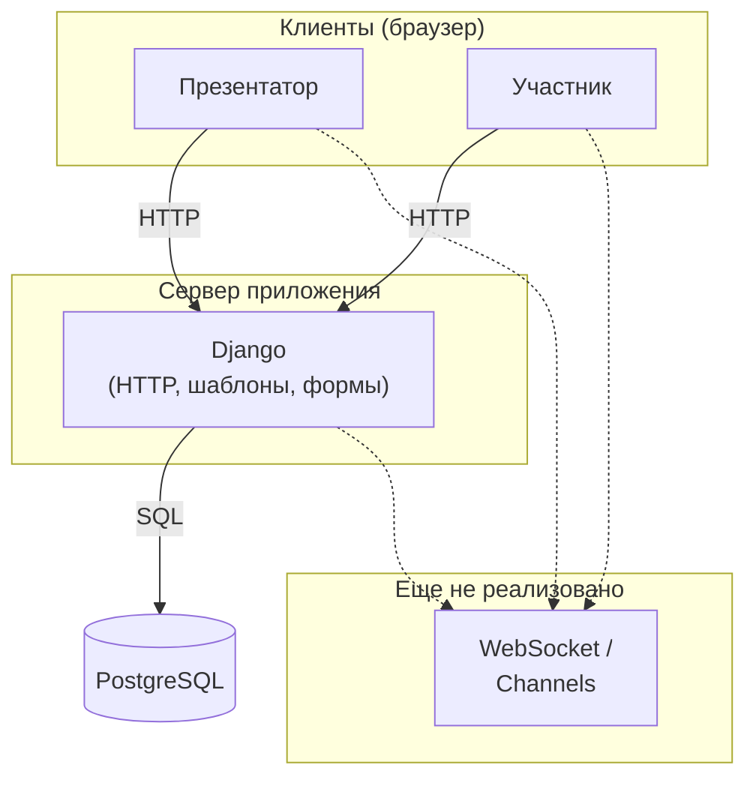

# Архитектура проекта QuizSlides

Документ для разработчиков. При существенных изменениях кода указывайте актуальную ветку и хеш коммита. Разделы дополняются по мере работы.

---

## 1. Общая схема системы

QuizSlides — веб-приложение: клиенты (браузеры) обращаются к серверу **Django** по **HTTP**; сервер читает и записывает данные в **PostgreSQL**. Сценарии с реальным временем (синхронизация слайдов, опросы, облако слов для всех участников) по [`use_cases.md`](../use_cases.md) предполагают в перспективе **двустороннюю связь** (например WebSocket / ASGI и Django Channels); на схеме это показано пунктиром как планируемый контур.

### 1.1. Логическая схема (уровень «кто с кем связан»)

### 1.2. Кратко по потокам данных

| Направление | Содержание |
|-------------|------------|
| Клиент → Django | Запросы страниц, формы (вход, регистрация, будущие экраны презентации), отправка ответов опроса и т.д. |
| Django → Клиент | HTML (Django Templates), редиректы, сообщения об ошибках |
| Django → PostgreSQL | ORM: пользователи, сессии, слайды, голоса и связанные сущности (`core`) |
| Реалтайм (в перспективе) | Рассылка смены слайда и обновлений виджетов всем подключённым участникам без полной перезагрузки страницы |

### 1.3. Что пойдёт в следующие разделы документа

Дальше по плану: детализация модулей (приложения Django, админка, URL), диаграммы компонентов и развёртки, работа с БД, экраны продукта — отдельными подразделами.
