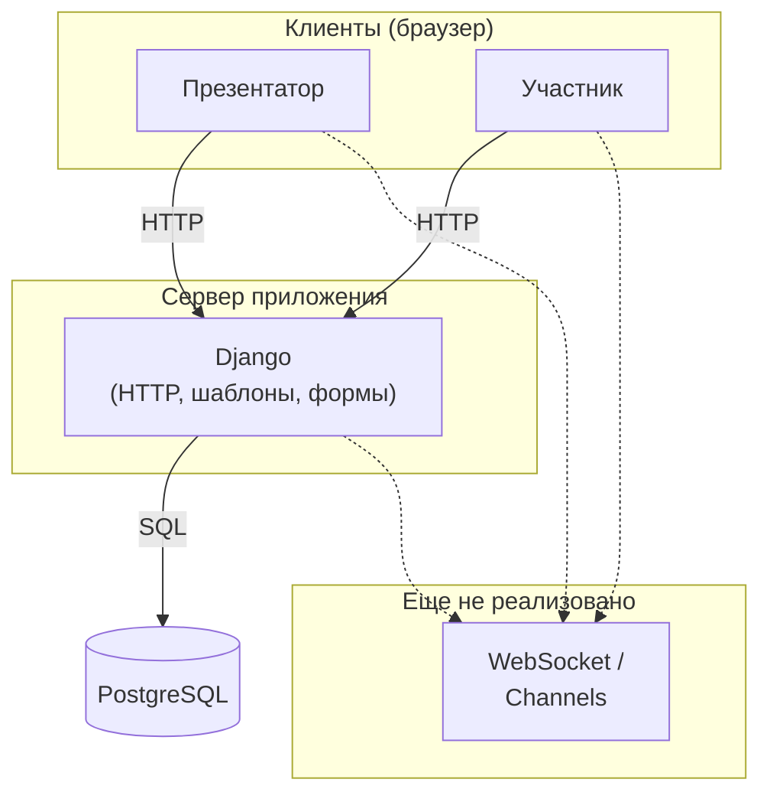
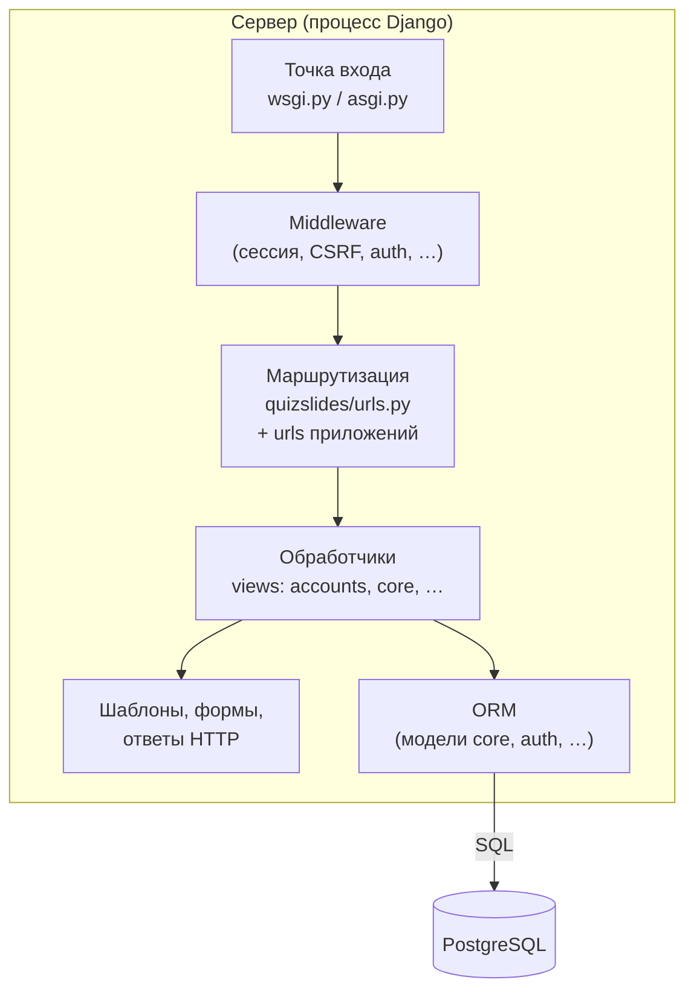

# Архитектура проекта QuizSlides

Документ для разработчиков. При существенных изменениях кода указывайте актуальную ветку и хеш коммита. Разделы дополняются по мере работы.

---

## 1. Общая схема системы

QuizSlides — веб-приложение: клиенты (браузеры) обращаются к серверу **Django** по **HTTP**; сервер читает и записывает данные в **PostgreSQL**. Сценарии с реальным временем (синхронизация слайдов, опросы, облако слов для всех участников) по [`use_cases.md`](../use_cases.md) предполагают в перспективе **двустороннюю связь** (например WebSocket / ASGI и Django Channels); на схеме это показано пунктиром как планируемый контур.

### 1.1. Логическая схема (уровень «кто с кем связан»)

### 1.2. Кратко по потокам данных

| Направление | Содержание |
|-------------|------------|
| Клиент → Django | Запросы страниц, формы (вход, регистрация, будущие экраны презентации), отправка ответов опроса и т.д. |
| Django → Клиент | HTML (Django Templates), редиректы, сообщения об ошибках |
| Django → PostgreSQL | ORM: пользователи, сессии, слайды, голоса и связанные сущности (`core`) |
| Реалтайм (в перспективе) | Рассылка смены слайда и обновлений виджетов всем подключённым участникам без полной перезагрузки страницы |

### 1.3. Основные компоненты системы

Ниже — основные компоненты репозитория

| Компонент | Роль |
|-----------|------|
| **Клиент (браузер)** | Отображение HTML, отправка форм и запросов по HTTP к Django. |
| **Конфигурация проекта** (`quizslides/`) | `settings.py` — приложения, middleware, шаблоны, БД, параметры входа; `urls.py` — корневые маршруты; `wsgi.py` / `asgi.py` — точки входа сервера (ASGI пока стандартный, без маршрутизации Channels). |
| **Приложение `accounts`** | Регистрация, вход, выход; маршруты под префиксом `/accounts/`. |
| **Приложение `core`** | Предметная область: модели сессий, презентаций, слайдов, виджетов, опросов, голосований и т.д.; регистрация моделей в админке Django. |
| **Шаблоны** (`templates/`) | Общий каркас страниц и страницы учётной записи (Django Templates). |
| **Встроенный функционал Django** | Админ-панель (`/admin/`), аутентификация и пользователи (`auth`), сессии, сообщения, статика — по настройкам `INSTALLED_APPS` и `MIDDLEWARE`. |
| **PostgreSQL** | Хранение данных приложения через ORM. |
| **WebSocket / Django Channels** | Не реализованы; отражены на схеме в блоке «Еще не реализовано» и в `use_cases.md` как целевая архитектура. |

Дополнительно в репозитории: каталог `web/` (отдельные HTML-страницы при необходимости), `manage.py`, `requirements.txt`.

### 1.4. Из чего состоит сервер

Схема ниже описывает **только сторону сервера** (без браузера): как запрос проходит через типовой стек Django в этом проекте и где участвует БД.

**Кратко по слоям:** процесс веб-сервера вызывает **WSGI/ASGI**-приложение → цепочка **middleware** → выбор **URL** и **view** → при необходимости рендер **шаблонов** и/или обращение к данным через **ORM** → запросы к **PostgreSQL**. Отдельного процесса Channels на схеме нет — см. блок «Еще не реализовано» в п. 1.1.

### 1.5. Что пойдёт в следующие разделы документа

Дальше по плану: детализация модулей (приложения Django, админка, URL), диаграммы компонентов и развёртки, работа с БД, экраны продукта — отдельными подразделами.
